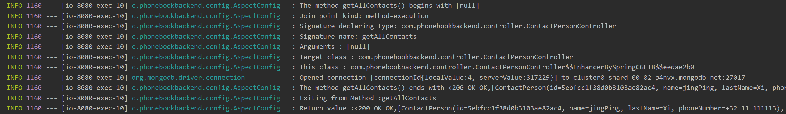

# PhoneBook_backend
- Add more practical back-end functions.
- The corresponding Angular CLI front-end for the dash board: https://github.com/huxingran1993/PhoneBook-Front-end
- The Login&Register page built with Vue.js:  https://github.com/huxingran1993/Vue-JWT

## Swagger
Swagger 2 is an open source project used to describe and document REST-ful APIs
- Add Swagger for Controllers
- Go to the url with Swagger UI: http://localhost:8080/swagger-ui.html#/

## AOP
- **AOP** is a programming paradigm that aims to increase modularity by allowing the separation of cross-cutting concerns.
- Implemented in config.AspectConfig
- **Joinpoint**: A Joinpoint is a point during the execution of a program, such as execution of a method or the handling of an exception.
- **Pointcut**: A Pointcut is a predicate that helps match an Advice to be applied by an Aspect at a particular JoinPoint. The Advice is often associated with a Pointcut expression and runs at any Joinpoint matched by the Pointcut.
- **Advice**: An advice is an action taken by an aspect at a particular Joinpoint. Different types of advice include “around,” “before” and “after” advice.\
- You can check the HttpRequest info like below:

## JWT
- User can sign-up new account, or login with username & password.
- By User’s role (admin, moderator, user), we authorize the User to access resources (role-based Authorization)
- Spring Security will manage cors, csrf, session, rules for protected resources, authentication & authorization along with exception handler.
- The database we will use is MongoDB which can be accessed by the help of Spring Data MongoDB.

## Testing
- Implement Unit Test and integrate unit test tool between JUnit and Mockito.
- Implement Integration testing the APIs in the controller with @WebMvcTest

## Docker
### Install
- I installed the Docker Desktop, easy to use.
### Dockerize your application

- Dockerize PhoneBook_backend to run it in an isolated environment, a.k.a. container.
- A container is a standardized unit of software that assembles code, runtime, dependencies, settings, and initialization in a single package that you can run reliably from one computing environment to another. 

### Step 
Run cmd, cd to the path of the application. eg. D:\git_repo\phone-book-backend
1. $ mvn package
2. $ docker build -t pb-docker .
3. $ docker run -p 5000:8080 -t pb-docker\
\
*Note: specified that the port 8080 on the container should be mapped to the port 5000 on the Host OS.*

#### Push to DockerHub
1. $ docker login
2. $ docker tag pb-docker huxingran/phone_book_backend:modified 
3. $ docker push huxingran/phone_book_backend:modified

- DockHub: https://hub.docker.com/repository/docker/huxingran/phone_book_backend/general

## Jenkins
- Install Jenkins Blue Ocean:\
\
docker pull jenkinsci/blueocean \
\
docker run -u root --rm -d -p 8080:8080 -p 50000:50000 -v jenkins-data:/var/jenkins_home -v /var/run/docker.sock:/var/run/docker.sock jenkinsci/blueocean

## ElasticSearch
### Install
- https://www.elastic.co/downloads/ download the Elasticsearch and Kibana according to your OS
- Unzip the files and run .bat in /bin. 
### Connect to the ES
- Configure the High Level REST Client in the config file to expose API specific methods.
- Elasticsearch listen for all transport request at port 9300, set it in application.yml
